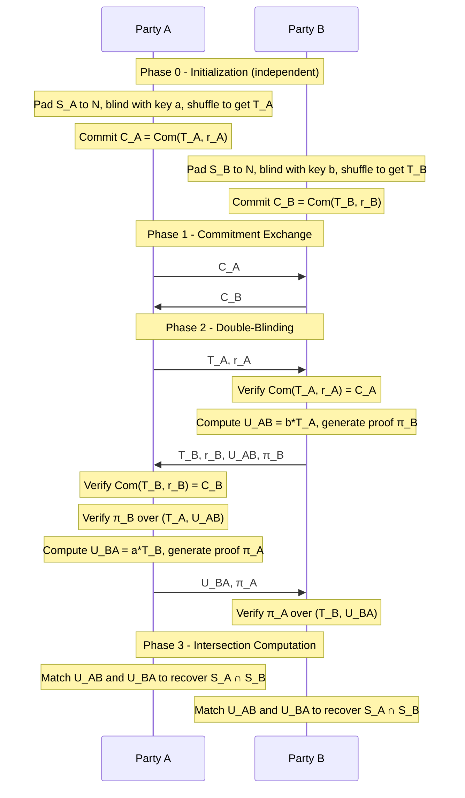

# Size-Hiding Private Set Intersection with Malicious Security

**Mutual Two-Party Variant for Small Sets with special focus on small domains**

---

## 1. Introduction

### 1.1 Purpose

This document specifies a cryptographic protocol for Private Set Intersection (PSI) between two mutually distrusting parties. The protocol allows both parties to learn which elements they share in common, without revealing any information about elements not in the intersection, and without revealing the size of either party's input set.

The protocol is designed for the following operational context:

- **Domain size:** The universe of possible element values, may be arbitrarily large. When the domain is small, the reduced enumeration cost creates additional attack surface; the protocol includes specific countermeasures (described in Section 6) to mitigate this.
- **Set scale:** Each party holds a small number of elements (fewer than 1000) drawn from this domain.
- **Security model:** Malicious adversaries who may deviate arbitrarily from the protocol.
- **Privacy goal:** Neither party learns the other party's set size or any elements outside the intersection.
- **Output:** Mutual. Both parties learn the intersection.
- **Architecture:** Strictly two-party. No trusted third party or certificate authority is involved at any stage.

When the domain is small, a malicious party could fill its input set with dictionary values to systematically probe the honest party's elements. This protocol addresses that threat through a carefully chosen pad-to size N that is much smaller than the domain, combined with rate limiting on protocol executions. For large domains, enumeration is computationally infeasible regardless of N. Section 6 provides a detailed analysis of the small-domain tradeoff.

### 1.2 Prior Work

This protocol builds on established techniques from the PSI literature. The foundational commutative-encryption approach was introduced by Huberman, Franklin, and Hogg (HFH99) and formalized by Freedman, Nissim, and Pinkas (FNP04). De Cristofaro and Tsudik (DCT10) refined this into a practical protocol with linear complexity, establishing the performance baseline that subsequent work builds on. The size-hiding variant (SHI-PSI) was first proposed by Ateniese, De Cristofaro, and Tsudik (ACT11), who demonstrated that hiding client set sizes incurs minimal overhead. The zero-knowledge proof techniques for malicious security draw from Chaum-Pedersen (CP92) discrete-log equality proofs and Schnorr (SCH91) signatures of knowledge.

### 1.3 Notation

| Symbol | Meaning |
|--------|---------|
| `G` | An elliptic curve group of prime order q with generator g |
| `q` | The order of group G (a large prime, typically 256 bits) |
| `H: {0,1}* → G` | A hash-to-curve function mapping arbitrary strings to group elements |
| `S_A, S_B` | Private input sets of Party A and Party B respectively |
| `N` | Public pad-to size parameter; both parties' blinded sets are padded to exactly N elements |
| `\|D\|` | Size of the element domain (the universe of possible values; may be arbitrarily large) |
| `a, b ∈ Z_q` | Secret blinding keys chosen uniformly at random by Party A and Party B |
| `Com(x; r)` | A Pedersen commitment to value x with randomness r |
| `π_A, π_B` | A zero-knowledge proof of discrete log equality (Chaum-Pedersen proof) for Party A and party B |
| `sid` | Unique session identifier for a protocol execution (random 128-bit nonce) |
| `id_A, id_B` | Stable identifiers for Party A and Party B |

---

## 2. Threat Model and Security Properties

### 2.1 Adversary Model

The protocol is secure against a malicious adversary who controls one of the two parties. The adversary may:

- Deviate arbitrarily from the protocol specification.
- Choose inputs adaptively based on messages received so far.
- Attempt to manipulate, reorder, drop, or inject messages.
- Attempt to learn information about the honest party's set beyond the intersection.

We assume the adversary is computationally bounded (probabilistic polynomial time) and that communication channels are authenticated (e.g., via TLS). We do not assume an honest majority; either party may be corrupt.

### 2.2 Security Properties

**Set privacy.** Neither party learns any element belonging to the other party's set that is not in the intersection. Formally, the view of a corrupt party can be simulated given only the intersection and the public parameters.

**Size hiding.** Neither party learns the cardinality of the other party's input set. All protocol messages are exactly the same size regardless of the actual number of real elements either party holds. This is achieved through deterministic padding to the public maximum N.

**Input independence.** The commitment phase ensures that neither party can choose their input set adaptively after observing the other party's protocol messages. Both parties commit to their blinded sets before any blinded elements are exchanged.

**Correctness.** If both parties follow the protocol honestly, both learn exactly S_A ∩ S_B and nothing else. The zero-knowledge proofs ensure that a malicious party cannot cause the honest party to compute an incorrect result (except by choosing a different input set before the protocol begins).

### 2.3 What Is Not Protected

**Fairness is not guaranteed.** Due to the sequential message flow, Party A learns the intersection after receiving message 4 but before sending message 5. A malicious Party A can therefore inspect the result and selectively abort — completing the protocol when the outcome is favorable and withholding message 5 otherwise, denying Party B any output. This is a fundamental limitation of two-party computation without honest majority (Cleve, 1986) and cannot be fully eliminated. Deployments should treat a missing message 5 as a protocol failure and log it for operational monitoring. Partial mitigations such as timed commitment release or optimistic fair exchange require additional infrastructure and are outside the scope of this protocol.

**Enumeration attacks are inherent to any PSI protocol.** A malicious party can choose its input set to be a dictionary of guessed values rather than its real secrets. Because blinded elements are cryptographically indistinguishable from one another, the honest party cannot detect whether the other side submitted real secrets or dictionary entries. This is not a flaw in the protocol — it is a fundamental property of private set intersection. Any protocol that hides set contents must also hide whether those contents are "real."

In this protocol, the enumeration surface is bounded by the pad-to parameter N: a malicious party can probe at most N elements per protocol execution. For large domains this is a negligible fraction; for small domains the fraction N/|D| may be significant. See Section 6 for a full analysis of this tradeoff, parameter selection guidance, and why alternative approaches involving trusted third parties were rejected.

---

## 3. Cryptographic Primitives

### 3.1 Elliptic Curve Group

We use the Ristretto255 group, which provides a prime-order group abstraction over Curve25519. This avoids cofactor complications and provides 128-bit security. The group order q is approximately 2^252.

### 3.2 Hash-to-Curve Function H

H maps arbitrary byte strings to elements of the Ristretto255 group. We use the Elligator 2 map as specified in RFC 9380 (Hashing to Elliptic Curves), Section 6.8 for Curve25519/Ristretto.

**Security requirement:** H must behave as a random oracle. No party should be able to find the discrete log of H(x) with respect to the generator g for any input x.

### 3.3 Pedersen Commitments

A Pedersen commitment scheme uses two independent generators g and h of the group G (where the discrete log of h with respect to g is unknown). To commit to a set of group elements {P_1, ..., P_N}:

    Com({P_i}; r) = r · h + Σ P_i

where r is a uniformly random scalar. The commitment is computationally binding (under the discrete log assumption) and perfectly hiding.

**In practice:** Each party commits to the multiset-hash of their blinded elements. This is computed as the sum of all blinded points plus a randomness term. The commitment is opened by revealing r and the set of points.

### 3.4 Chaum-Pedersen Proof of Consistent Exponentiation

The core zero-knowledge proof used in this protocol demonstrates that a party applied the same secret exponent to every received element. Given input points {P_1, ..., P_N} and output points {Q_1, ..., Q_N}, the prover demonstrates knowledge of a scalar k such that Q_i = k · P_i for all i.

The protocol proceeds as follows (using Fiat-Shamir heuristic for non-interactivity):

**Prover** (knows secret k):

1. For each i, choose random v_i, compute R_i = v_i · P_i.
2. Compute challenge: c = Hash("CP_proof" || sid || id_prover || id_verifier || C_A || C_B || P_1 || Q_1 || R_1 || ... || P_N || Q_N || R_N), where sid is the unique session identifier and C_A, C_B are the commitments from Phase 1. The domain separator "CP_proof" and the session context prevent cross-session and cross-party proof replay.
3. Compute response: s_i = v_i - c · k (mod q) for each i.
4. Send π = (c, {s_i}).

**Verifier:**

1. For each i, compute R'_i = s_i · P_i + c · Q_i.
2. Recompute c' using the same context-bound hash as the prover.
3. Accept if and only if c = c'.

**Batch optimization:** For efficiency, use a single random linear combination. Derive deterministic weights w_1, ..., w_N via Fiat-Shamir: compute w_i = Hash("CP_batch_weight" || sid || C_A || C_B || P_1 || Q_1 || ... || P_N || Q_N || i). The weights must not be chosen by the prover, as prover-chosen weights allow a cheating prover to cancel inconsistencies in the weighted sum. Prove that Σ w_i · Q_i = k · (Σ w_i · P_i). This reduces the proof to a single Chaum-Pedersen instance with soundness error 1/q, which is negligible.

---

## 4. Protocol Specification

### 4.1 Public Parameters

Before protocol execution, both parties agree on:

| Parameter | Description |
|-----------|-------------|
| `G, g, q` | Ristretto255 group, generator, and order |
| `h` | Second generator for Pedersen commitments (h = H("pedersen_generator")) |
| `N` | Pad-to size. |
| `H` | Hash-to-curve function as specified in Section 3.2 |
| `D` | The element domain (the universe from which real set elements are drawn) |
| `sid` | A unique session identifier for this protocol execution (e.g., a random 128-bit nonce agreed upon or derived at session start). Must never be reused across executions. |
| `id_A, id_B` | Stable identifiers for Party A and Party B (e.g., public keys or authenticated endpoint identifiers). Used in Fiat-Shamir transcript binding to prevent cross-party proof replay. |

### 4.2 Phase 0: Initialization

Each party independently prepares their input.

**Party A:**

1. Let S_A = {x_1, ..., x_m} be the real input set where m ≤ N.
2. Generate N - m dummy elements d_1, ..., d_{N-m} by sampling random strings from a dummy domain D' disjoint from D (e.g., by prepending a fixed tag: d_i = "DUMMY_" || random_bytes(32)).
3. Form the padded set S'_A = {x_1, ..., x_m, d_1, ..., d_{N-m}} of exactly N elements.
4. Sample secret blinding key a ← Z_q uniformly at random.
5. Compute the blinded set: for each element e ∈ S'_A, compute P_e = a · H(e).
6. Randomly permute the blinded set to obtain T_A = σ_A({P_e}). (This local permutation prevents the ordering of T_A from revealing which positions hold real elements and which hold dummies. It requires no proof since the permutation is not communicated.)

**Party B:** Performs the identical procedure with their set S_B and blinding key b to produce T_B.

### 4.3 Phase 1: Commitment Exchange

This phase prevents adaptive input selection.

1. Party A computes commitment C_A = Com(T_A; r_A) where r_A ← Z_q.
2. Party B computes commitment C_B = Com(T_B; r_B) where r_B ← Z_q.
3. Party A sends C_A to Party B.
4. Party B sends C_B to Party A.
5. Both parties wait until they have received the other's commitment before proceeding to Phase 2. (Simultaneous exchange can be achieved via a standard coin-toss protocol if a synchronous channel is not available.)

### 4.4 Phase 2: Blinded Set Exchange and Double-Blinding

This is the core phase where elements are double-blinded.

**Step 2a — A sends blinded set to B:**

1. Party A opens commitment C_A by sending (T_A, r_A) to Party B.
2. Party B verifies that Com(T_A; r_A) = C_A. If verification fails, abort.
3. Party B verifies that |T_A| = N. If not, abort.

**Step 2b — B double-blinds A's set and sends own set:**

1. Party B computes the double-blinded set: for each P ∈ T_A, compute Q = b · P = ab · H(e). Let U_AB denote this sequence of double-blinded points (preserving the order of T_A).
2. Party B generates zero-knowledge proof π_B proving consistent exponentiation: that the same scalar b was applied to every element of T_A to produce U_AB (see Section 3.4).
3. Party B opens commitment C_B by sending (T_B, r_B) to Party A, along with U_AB and π_B.

**Step 2c — A verifies and double-blinds B's set:**

1. Party A verifies that Com(T_B; r_B) = C_B. If verification fails, abort.
2. Party A verifies that |T_B| = N and |U_AB| = N. If not, abort.
3. Party A verifies π_B against the ordered pair (T_A, U_AB). If verification fails, abort.
4. Party A computes the double-blinded set of B's elements: for each P ∈ T_B, compute Q = a · P = ba · H(e). Let U_BA denote this sequence.
5. Party A generates π_A proving consistent exponentiation with scalar a over (T_B, U_BA).
6. Party A sends U_BA and π_A to Party B.

**Step 2d — B verifies A's double-blinding:**

1. Party B verifies that |U_BA| = N. If not, abort.
2. Party B verifies π_A against the ordered pair (T_B, U_BA). If verification fails, abort.

### 4.5 Phase 3: Intersection Computation

Both parties now independently compute the intersection.

**Party A holds:** U_AB (the double-blinded version of A's own elements, blinded by a then b, computed by B) and U_BA (the double-blinded version of B's elements, blinded by b then a, computed by A).

**Key property:** For any element e, the value ab · H(e) = ba · H(e) because scalar multiplication is commutative in Z_q. Therefore, if element e appears in both S_A and S_B, the corresponding double-blinded point will appear in both U_AB and U_BA.

**Computation:** Party A computes the multiset intersection I_A = U_AB ∩ U_BA. Each matching point corresponds to a shared element. Party A can identify which of their original elements are in the intersection by maintaining a mapping from their blinded elements to the double-blinded points: for each original element x_i, the double-blinded form is b · (a · H(x_i)), which appears at the same position in U_AB as a · H(x_i) appeared in T_A.

**Party B** performs the identical computation using the same two sets (B has U_AB because B created it, and received U_BA from A).

**Output:** Both parties output the set of original elements corresponding to matching double-blinded points.

---

## 5. Message Format and Communication

### 5.1 Message Summary

| Msg # | From | To | Contents |
|-------|------|----|----------|
| 1 | A | B | C_A (32 bytes: commitment to blinded set) |
| 2 | B | A | C_B (32 bytes: commitment to blinded set) |
| 3 | A | B | T_A (N × 32 bytes: blinded set), r_A (32 bytes: commitment randomness) |
| 4 | B | A | T_B (N × 32 bytes), r_B (32 bytes), U_AB (N × 32 bytes: double-blinded A), π_B (CP proof) |
| 5 | A | B | U_BA (N × 32 bytes: double-blinded B), π_A (CP proof) |

### 5.2 Communication Complexity

With Ristretto255 (32-byte points) and the batched Chaum-Pedersen proof, the total communication per party is approximately:

    Per party ≈ 2 × N × 32 + 128 bytes
    Total     ≈ 4 × N × 32 + 256 bytes

The 128-byte per-party overhead is: one commitment (32 bytes) + one commitment nonce (32 bytes) + one batched CP proof (64 bytes: one scalar challenge + one scalar response). For N = 10, this is approximately 0.75 KB per party, or 1.5 KB total.

---

## 6. Security Analysis

### 6.1 Security Theorem (Informal)

Under the Decisional Diffie-Hellman (DDH) assumption in the Ristretto255 group and modelling H as a random oracle, the protocol securely computes the set intersection functionality against malicious adversaries. Specifically:

**Privacy:** A corrupt Party A (resp. B) learns nothing beyond S_A ∩ S_B and the public parameter N. The simulator extracts the corrupt party's effective input from the commitment and ZK proofs, queries the ideal functionality, and simulates the remaining messages using random group elements for non-intersecting positions.

**Size hiding:** Since all messages contain exactly N group elements (regardless of the true set sizes), the transcript is computationally indistinguishable for any two input sets of different sizes, as long as both are ≤ N. The dummy elements are indistinguishable from real blinded elements under DDH.

### 6.2 Proof Sketch

**Simulator construction for corrupt Party A:**

1. Receive C_A from the adversary.
2. Send a random commitment C_B (simulated) to the adversary.
3. Receive (T_A, r_A) from the adversary. Verify the commitment opens correctly.
4. Extract the adversary's effective input set by using the ZK extractor on the proof of knowledge implicit in the commitment scheme.
5. Query the ideal PSI functionality with the extracted set to learn the intersection.
6. Simulate T_B, U_AB, and the proof π_B. For elements in the intersection, ensure the double-blinded values match. For all other positions, use random group elements.
7. Receive U_BA and π_A from the adversary (which may be malformed; the simulator verifies and aborts if invalid, matching the honest party's behavior).

The indistinguishability of the simulation relies on DDH: random group elements are indistinguishable from properly double-blinded dummy/non-intersecting elements.

### 6.2.1 Commitment Binding and Multiset-Hash Collisions

The Pedersen commitment (Section 3.3) binds to the sum of blinded points, not to the individual elements. Two distinct multisets {P_1, ..., P_N} and {P'_1, ..., P'_N} with the same sum Σ P_i = Σ P'_i would produce identical commitments for the same randomness r. A malicious party that finds such a collision could commit to one set and open with another, violating input independence.

Finding a collision requires discovering a non-trivial integer-coefficient relation among the blinded points {a · H(x) : x ∈ D ∪ D'}, which reduces to the discrete logarithm problem in the Ristretto255 group. Even though the domain D is small (|D| ≈ 100), the blinding key a is chosen by the committing party, so the relevant hardness assumption is that no polynomial-time adversary can find a non-trivial kernel element in the group generated by {H(x) : x ∈ D ∪ D'}. Under the discrete log assumption in a prime-order group of order ~2^252, this holds with overwhelming probability: the expected work to find a relation among N ≤ 100 random group elements is O(√q) ≈ 2^126, which exceeds the security parameter.

### 6.3 Enumeration Attack Analysis

A malicious party could pad their set with a dictionary of likely values (rather than random dummies) to learn which elements the honest party holds. This section analyzes the threat in the context of this protocol's target deployment (domain |D| = 100, real sets of ~10 elements) and explains the chosen mitigation strategy.

#### 6.3.1 The enumeration threat in small domains

In a domain of 100 values, a malicious party that can submit N = 100 elements would learn the honest party's complete set in a single run by simply including every possible value. This is catastrophic. Even N = 50 would expose half the domain per run.

The attack cannot be detected by the honest party. Blinded elements (whether derived from real secrets or dictionary entries) are computationally indistinguishable under the DDH assumption. No verification step in the protocol can distinguish legitimate inputs from adversarial probes. This is a fundamental property, not a protocol weakness.

#### 6.3.2 Mitigation: Capping N well below |D|

The primary defense is setting the pad-to parameter N much smaller than the domain size |D|, following the bounded size-hiding approach of Bradley, Faber, and Tsudik (BTF16) who showed that security can be maintained even when the pad-to size does not cover the full domain. With N = 10 and |D| = 100:

- **Per-run exposure:** An attacker can probe at most N/|D| = 10% of the domain per execution. If the honest party holds 10 elements, the expected number of elements an attacker discovers per run is approximately 10 × (10/100) = 1.
- **Runs to full enumeration:** An attacker needs at least ⌈|D|/N⌉ = 10 protocol executions to cover the entire domain.
- **Upper bound on set size:** Setting N = 10 reveals that both parties hold at most 10 elements. In this deployment, this upper bound is an acceptable disclosure since both parties already know the approximate set sizes.

#### 6.3.3 Rate limiting as a complementary control

Capping N alone is insufficient if the protocol can be executed without restriction. Rate limiting is essential:

- **One execution per party-pair per time window.** If the protocol is limited to a single execution between any two parties (or one per day/week), the attacker's enumeration is capped at N elements total.
- **Session binding.** Each protocol execution should be bound to a unique session identifier (the sid parameter). Parties must verify that they are not engaging in a replay of a previous session.
- **Abort-rate monitoring.** Aborted protocol runs must count against the rate limit equally with completed runs. A selective-abort strategy (see Section 2.3) leaks one bit per attempt (abort vs. completion), and an attacker who can trigger unlimited aborts can use this as an oracle. Similarly, a party that observes repeated aborts from a counterparty should flag this as potentially adversarial.
- **Operational monitoring.** In a deployment with multiple parties, a party that initiates an unusual number of protocol executions with different counterparties may be attempting to triangulate elements and should be flagged.

## 7. Notes for implementers

### 7.1 Proof of concept

This repo contains a proof of concept implementation in 553 total lines, 410 lines of code. It can run both sides of the protocol in ~20ms for N=10 and ~200ms for N=500.

### 7.2 Security Considerations for implementers

- All scalar multiplications must be constant-time to prevent timing side-channel attacks.
- Random number generation must use a cryptographically secure PRNG (e.g., /dev/urandom, getrandom(), or equivalent).
- The hash-to-curve function must be implemented correctly per RFC 9380. An incorrect implementation can leak information about inputs.
- Dummy elements must be generated from a domain provably disjoint from the real element domain D. A simple approach: prepend a fixed tag byte (e.g., 0xFF) to random bytes, while all real elements are prepended with 0x00.
- The commitment scheme must use independent randomness for each protocol execution.
- The blinding key (a or b) must be freshly sampled for every protocol execution. Reusing a blinding key across sessions causes the same blinded elements to appear in multiple transcripts, allowing a coalition of counterparties (or a single adversary using multiple identities) to correlate elements across sessions and break set privacy. Implementations should derive the blinding key from a per-session random seed and must never persist or cache it.
- Abort immediately on any verification failure. Do not continue the protocol or provide detailed error messages that could leak information.

## 8. References

- **[ACT11]** G. Ateniese, E. De Cristofaro, G. Tsudik. "(If) Size Matters: Size-Hiding Private Set Intersection."
- **[BTF16]** T. Bradley, S. Faber, G. Tsudik. "Bounded Size-Hiding Private Set Intersection."
- **[CP92]** D. Chaum, T. Pedersen. "Wallet Databases with Observers."
- **[DCT10]** E. De Cristofaro, G. Tsudik. "Practical Private Set Intersection Protocols with Linear Complexity."
- **[FNP04]** M. Freedman, K. Nissim, B. Pinkas. "Efficient Private Matching and Set Intersection."
- **[HFH99]** B. Huberman, M. Franklin, T. Hogg. "Enhancing Privacy and Trust in Electronic Communities."
- **[RFC9380]** IRTF CFRG. "Hashing to Elliptic Curves."
- **[SCH91]** C. Schnorr. "Efficient Signature Generation by Smart Cards."
